# 🏥 MedAware — Community Health Forum

> A mobile-first community health Q&A platform built with **Next.js 15**. Ask health questions, get verified professional answers, and join a supportive medical community — powered by Moroccan users across the Kingdom 🇲🇦

---

## ✨ Features

| Feature | Description |
|---|---|
| **Health Feed** | Browse, search & filter health questions by trending, newest, or unanswered |
| **AI Triage** | Automatic category detection (Cardiology, Neurology, Dermatology…) when creating posts |
| **MythShield™** | Fact-check panels with WHO/CDC/Harvard sources on common health myths |
| **Expert Badges** | Verified professionals (doctors, nurses) are visually distinguished |
| **Emergency Detection** | Auto-detects urgent keywords (chest pain, stroke…) and shows a 🚨 banner with emergency resources |
| **Voting & Reactions** | Upvote/downvote posts, react to comments with "thanked" & "informative" |
| **User Profiles** | Editable profile with bio, location, stats, and recent activity |
| **Bookmarks** | Save posts for later (persisted in localStorage) |
| **Toast Notifications** | Contextual success toasts for actions |
| **Bottom Navigation** | Mobile-style nav bar (Home, Create, Profile) |

---

## 📸 Screenshots

### Home Feed

| Trending (default) | Newest | Unanswered |
|:---:|:---:|:---:|
| 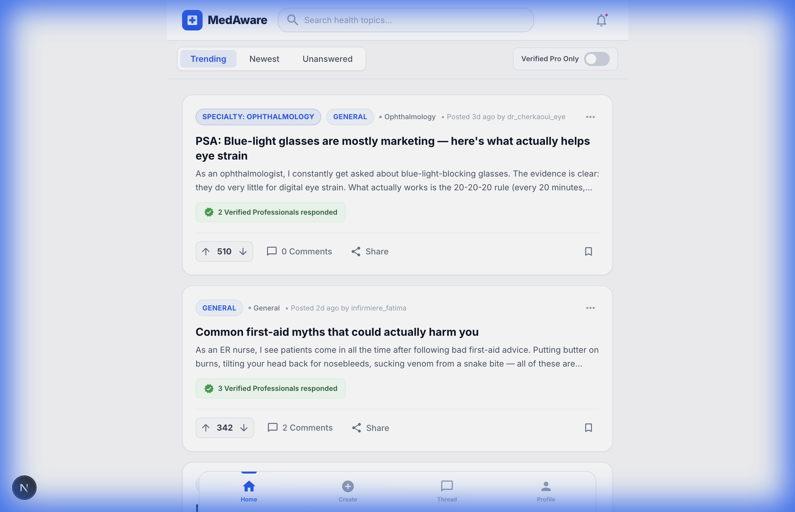 | 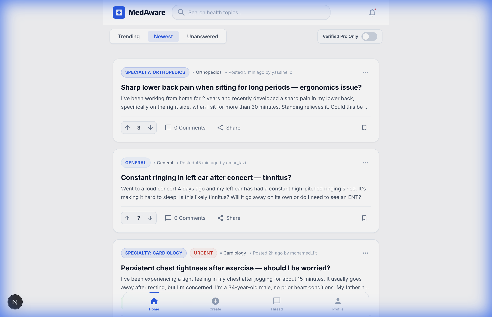 | 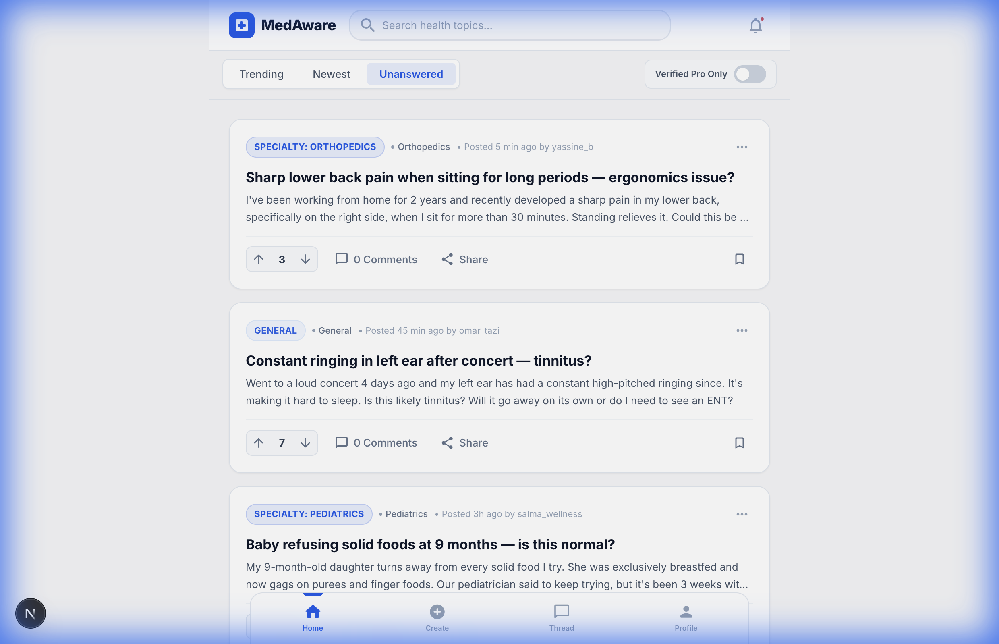 |

| Search | Verified Pro Only |
|:---:|:---:|
| 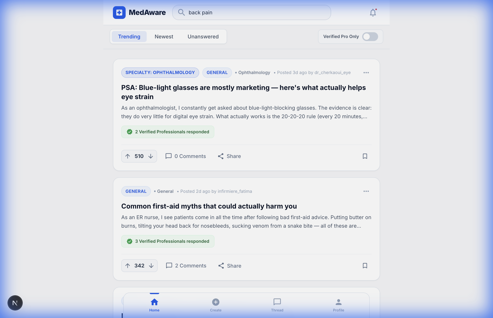 | 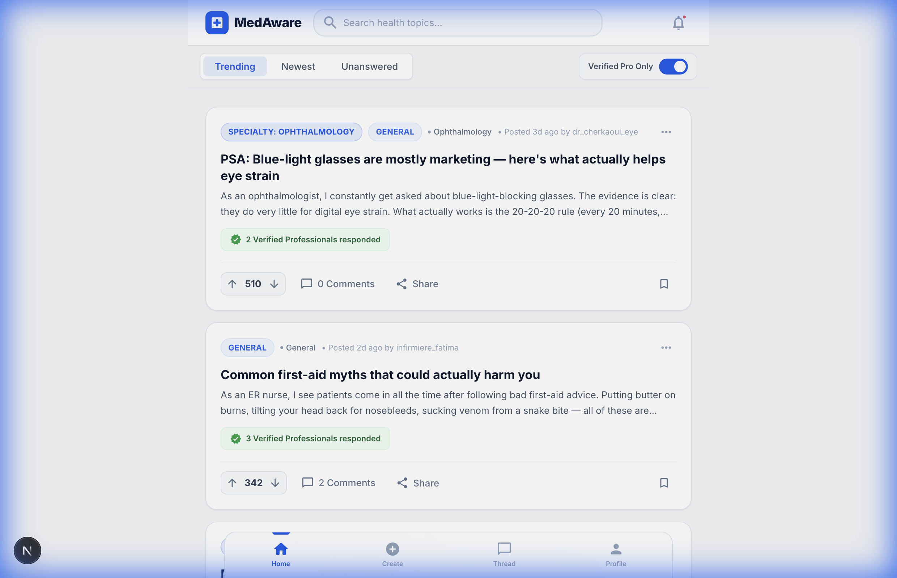 |

### Thread View

| Post Detail + Expert Response | MythShield & Comments | Upvote Interaction |
|:---:|:---:|:---:|
|  | 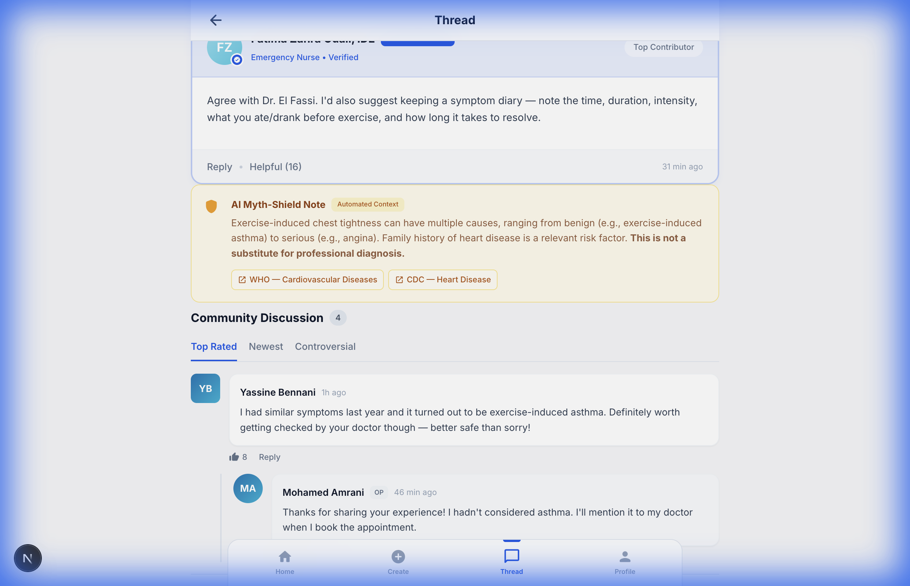 | 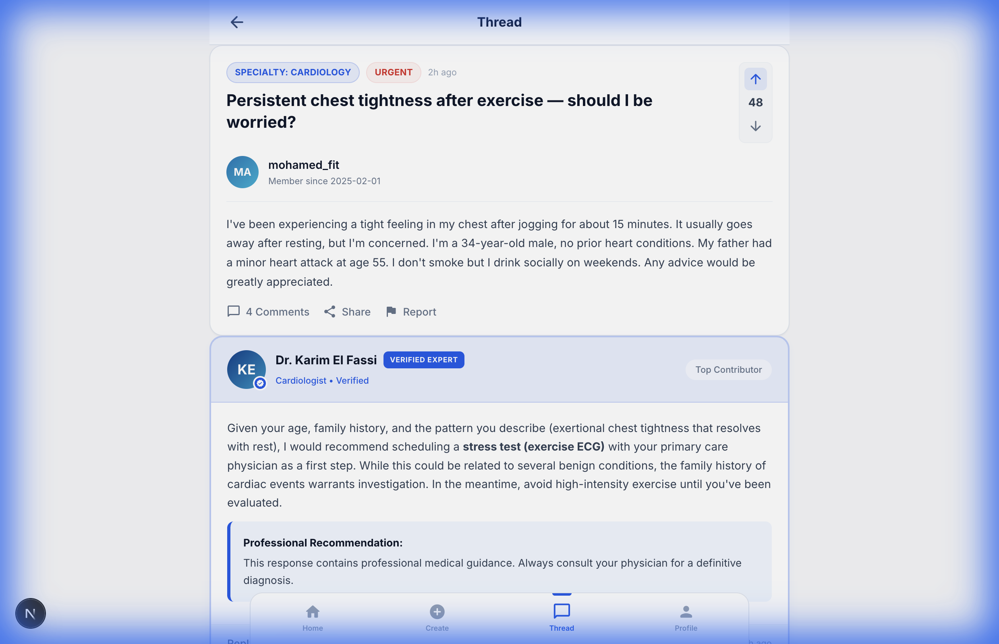 |

### Create Post

| Empty Form | AI Triage Detection | Emergency Banner |
|:---:|:---:|:---:|
| 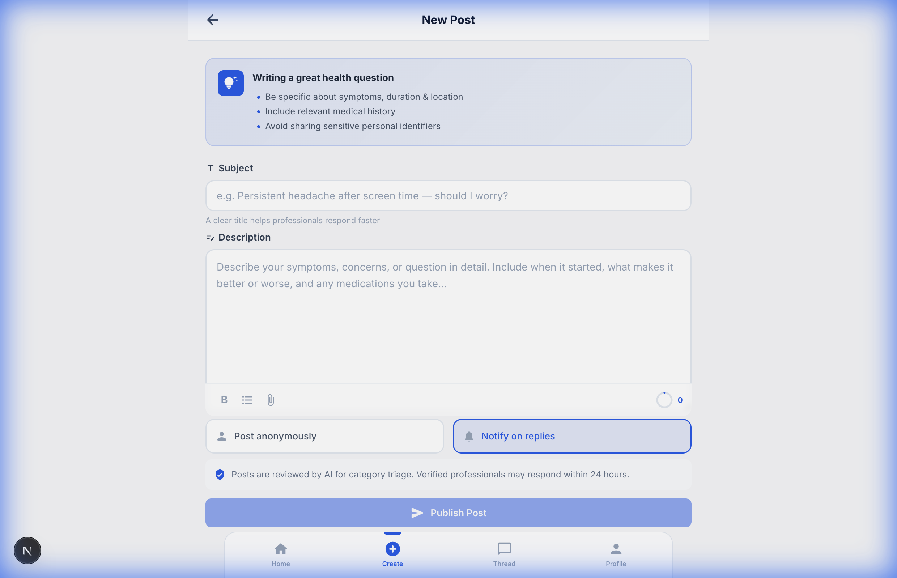 | 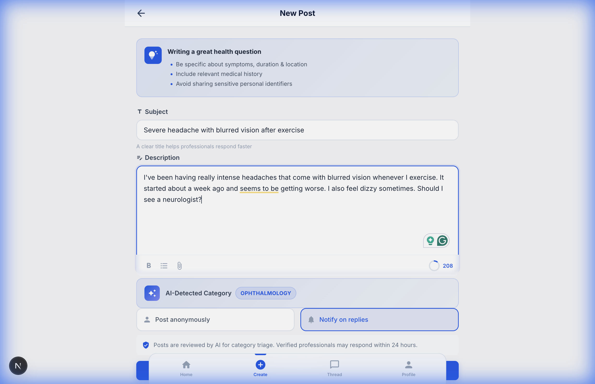 | 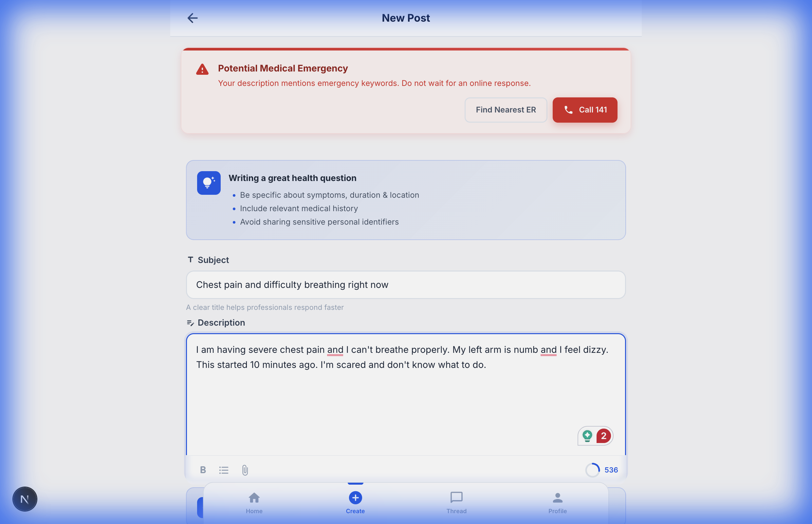 |

### Profile

| Profile View | Edit Profile Modal |
|:---:|:---:|
| 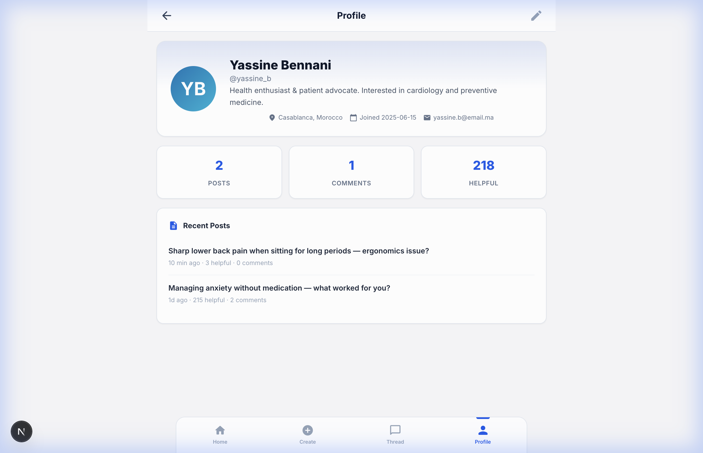 | 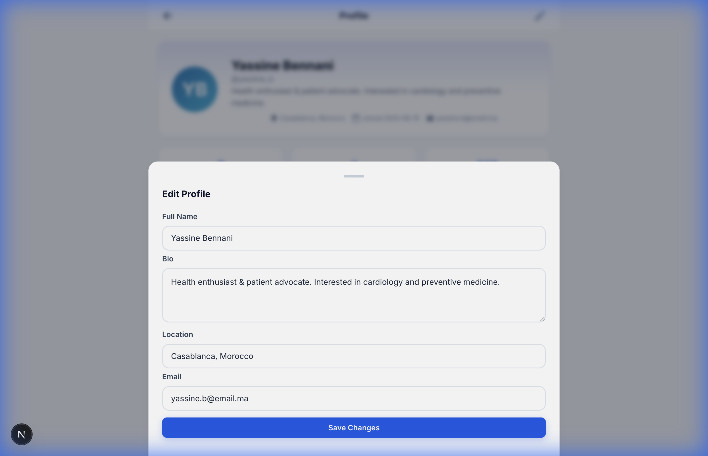 |

---

## 🚀 Getting Started

### Prerequisites

- **Node.js** ≥ 18
- **npm** (or yarn / pnpm / bun)

### Installation

```bash
# Clone the repo
git clone <your-repo-url>
cd 1337

# Install dependencies
npm install

# Start the development server
npm run dev
```

Open [http://localhost:3000](http://localhost:3000) in your browser.

---

## 🗂 Project Structure

```
1337/
├── app/
│   ├── layout.js           # Root layout with ToastProvider & BottomNav
│   ├── page.js             # Home feed — search, filter, post list
│   ├── globals.css         # Full design system (tokens, components, animations)
│   ├── create/
│   │   └── page.js         # Create Post — AI triage, emergency detection
│   ├── post/
│   │   └── [id]/page.js    # Thread view — comments, expert cards, MythShield
│   └── profile/
│       └── page.js         # User profile — stats, edit modal, recent posts
├── components/
│   ├── BottomNav.js        # Mobile bottom navigation
│   ├── CommentBubble.js    # Comment display with reactions & replies
│   ├── EmergencyBanner.js  # 🚨 Emergency detection banner
│   ├── ExpertCard.js       # Verified professional response card
│   ├── FilterTabs.js       # Trending / Newest / Unanswered tabs
│   ├── Modal.js            # Reusable modal overlay
│   ├── MythShield.js       # AI fact-check panel with sources
│   ├── PostCard.js         # Post card for the feed
│   └── VotePill.js         # Upvote/downvote pill
├── context/
│   └── ToastContext.js     # Global toast notification context
├── lib/
│   ├── db.js               # localStorage-backed database with seed data
│   └── helpers.js          # Shared utilities (timeAgo, category detection, etc.)
└── public/                 # Static assets
```

---

## 👥 Seed Data — Moroccan Community

The app ships with realistic mock data featuring **Moroccan users** across multiple cities:

| Name | Role | City |
|---|---|---|
| **Yassine Bennani** | Community Member (you) | Casablanca |
| **Dr. Karim El Fassi** | Cardiologist ✅ | Rabat |
| **Fatima Zahra Ouali, IDE** | Emergency Nurse ✅ | Tanger |
| **Mohamed Amrani** | Fitness Enthusiast | Marrakech |
| **Hajar Idrissi** | Health Myth Debunker | Fès |
| **Omar Tazi** | Chronic Migraine Patient | Meknès |
| **Dr. Amine Cherkaoui, MD** | Ophthalmologist ✅ | Agadir |
| **Salma Berrada** | Wellness Blogger & Mom | Oujda |

The seed includes **12 health posts** covering cardiology, neurology, dermatology, psychiatry, pediatrics, ophthalmology, and general health — plus **10 threaded comments** with expert responses and community discussion.

---

## 🧰 Tech Stack

- **Framework**: [Next.js 15](https://nextjs.org) (App Router)
- **Language**: JavaScript (React)
- **Styling**: Vanilla CSS with CSS custom properties
- **Typography**: [Inter](https://fonts.google.com/specimen/Inter) via Google Fonts
- **Icons**: [Material Icons Round](https://fonts.google.com/icons)
- **Storage**: `localStorage` (no backend required)

---

## 🔧 Key Implementation Details

### Database Layer (`lib/db.js`)

A fully client-side data layer using `localStorage`:
- **Auto-seeding**: On first load, generates the full Moroccan user community + posts + comments
- **CRUD API**: `getPosts()`, `addPost()`, `votePost()`, `getComments()`, `addComment()`, `reactToComment()`
- **Reset**: Call `resetDB()` to clear all data and re-seed

### AI Triage System (`lib/helpers.js` + `app/create/page.js`)

When composing a post, the description is scanned against regex patterns to auto-detect the medical specialty. An animated "AI Triage analyzing…" overlay appears, followed by a category badge.

### Emergency Detection

Keywords like *chest pain*, *heart attack*, *stroke*, *can't breathe*, *seizure*, *overdose*, and *suicid* trigger an emergency banner with a direct link to Google Maps for the nearest ER.

---

## 📋 Available Scripts

| Command | Action |
|---|---|
| `npm run dev` | Start development server |
| `npm run build` | Build for production |
| `npm run start` | Start production server |
| `npm run lint` | Run ESLint |

---

## 📄 License

This project is for educational purposes.
